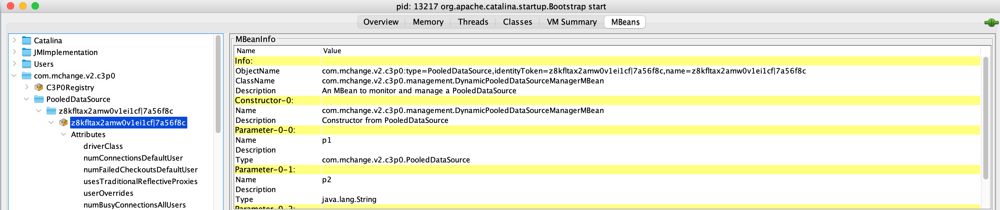
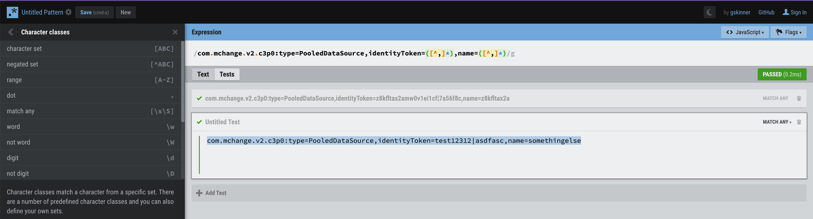
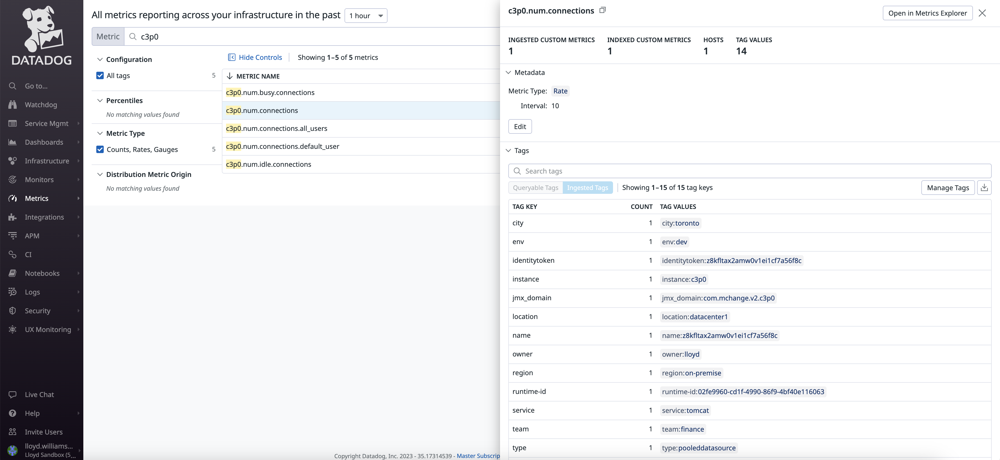

# JMX

For Tomcat, if you are going to use the JMX integration (with the Datadog Agent) you need to open the JMX port for Tomcat:

```
-Dcom.sun.management.jmxremote \
 -Dcom.sun.management.jmxremote.authenticate=false -Dcom.sun.management.jmxremote.ssl=false \
 -Dcom.sun.management.jmxremote.local.only=false -Dcom.sun.management.jmxremote.port=9012 \
```

then that is the port number that you use for the Tomcat integration in `tomcat.d/conf.yaml`

If you are going to try to do APM with the Tomcat Server, then you need this (but you don’t need the lines above — except temporarily for jmxterm or using jconsole from a server that’s not the local server):

```
export CATALINA_OPTS="-javaagent:${JAVA_AGENT_HOME}/dd-java-agent.jar"
```

then you can specify that you want the Tomcat default metrics in addition to the JVM metrics that it will collect automatically by setting:

```
export DD_JMXFETCH_TOMCAT_ENABLED=true
```

since the Datadog jmxfetch logic and the default `tomcat.d/metrics.yaml` is pre-bundled into the `dd-java-agent.jar`

If you need a custom JMX metrics file (for example c3p0 connection pool monitoring is not supported out-of-the-box, but has JMX metrics available) with APM enabled, you can just specify it like this:

```
-Ddd.jmxfetch.config=/Users/lloyd.williams/u01/jmx/c3p0/conf3.yaml"
```

or this way (but not both):

```
export DD_JMXFETCH_CONFIG=/Users/lloyd.williams/u01/jmx/c3p0/conf3.yaml
```

If the metric that the customer is looking to get has a configured or random part of the name in it, you may have to use `bean_regex`

For example:

```
com.mchange.v2.c3p0:type=PooledDataSource,identityToken=z8kfltax2amw0v1ei1cf|7a56f8c,name=z8kfltax2amw0v1ei1cf|7a56f8c
```

bean_regex:

```
com.mchange.v2.c3p0:type=PooledDataSource,identityToken=([^,]*),name=([^,]*)
```

Here's a [sample](https://github.com/lloydwilliams/metrics/blob/main/jmx/c3p0/conf.yaml)

Notice that when you use the approach leveraging APM that you need to specify:

```
jvm_direct: true
```

You can test the bean regex expressions against the ObjectNames from JConsole with a regex testing tool (e.g. https://regexr.com/)



Regex Testing



If you need to use JMXTerm, the customer will need to download the jar. They can get it from [here](https://github.com/jiaqi/jmxterm/releases/download/v1.0.4/jmxterm-1.0.4-uber.jar).
Then run it like this using the port number you used with: -Dcom.sun.management.jmxremote.port=9012

```
java -jar jmxterm-1.0.4-uber.jar --url localhost:9012
```

then you can use the commands:

- domains
- domain  (with one of the domain names that it listed)
- beans
- bean  (with one of the beans that it listed)
- info

For example:

```
$>domains
#following domains are available
Catalina
JMImplementation
Users
com.sun.management
java.lang
java.nio
java.util.logging
jdk.management.jfr

$>domain Catalina
#domain is set to Catalina

$>beans
#domain = Catalina:
Catalina:J2EEApplication=none,J2EEServer=none,WebModule=//localhost/,j2eeType=Filter,name=Tomcat WebSocket (JSR356) Filter
Catalina:J2EEApplication=none,J2EEServer=none,WebModule=//localhost/,j2eeType=Servlet,name=default
Catalina:J2EEApplication=none,J2EEServer=none,WebModule=//localhost/,j2eeType=Servlet,name=jsp
Catalina:J2EEApplication=none,J2EEServer=none,WebModule=//localhost/,name=jsp,type=JspMonitor
Catalina:J2EEApplication=none,J2EEServer=none,WebModule=//localhost/examples,j2eeType=Servlet,name=HelloWorldExample
Catalina:type=UtilityExecutor
$>bean Catalina:J2EEApplication=none,J2EEServer=none,WebModule=//localhost/examples,j2eeType=Servlet,name=HelloWorldExample
#bean is set to Catalina:J2EEApplication=none,J2EEServer=none,WebModule=//localhost/examples,j2eeType=Servlet,name=HelloWorldExample
$>info
#mbean = Catalina:J2EEApplication=none,J2EEServer=none,WebModule=//localhost/examples,j2eeType=Servlet,name=HelloWorldExample
#class name = org.apache.catalina.mbeans.ContainerMBean
# attributes
  %0   - asyncSupported (boolean, rw)
  %1   - available (long, rw)
  %2   - backgroundProcessorDelay (int, rw)
  %3   - classLoadTime (int, r)
  %4   - countAllocated (int, r)
  %5   - errorCount (int, r)
  %6   - loadOnStartup (int, rw)
  %7   - loadTime (long, r)
  %8   - maxInstances (int, rw)
  %9   - maxTime (long, r)
  %10  - minTime (long, r)
  %11  - modelerType (java.lang.String, r)
  %12  - objectName (java.lang.String, rw)
  %13  - processingTime (long, r)
  %14  - requestCount (int, r)
  %15  - runAs (java.lang.String, rw)
  %16  - servletClass (java.lang.String, r)
  %17  - singleThreadModel (java.lang.Boolean, r)
  %18  - stateName (java.lang.String, r)
# operations
  %0   - void addInitParameter(java.lang.String name,java.lang.String value)
  %1   - void addLifecycleListener(java.lang.String type)
  %2   - void addMapping(java.lang.String mapping)
  %3   - void addSecurityReference(java.lang.String name,java.lang.String link)
  %4   - java.lang.String addValve(java.lang.String valveType)
  %5   - java.lang.String findInitParameter(java.lang.String name)
  %6   - [Ljava.lang.String; findInitParameters()
  %7   - org.apache.catalina.Wrapper findMappingObject()
  %8   - [Ljava.lang.String; findMappings()
  %9   - java.lang.String findSecurityReference(java.lang.String name)
  %10  - [Ljava.lang.String; findSecurityReferences()
  %11  - void removeInitParameter(java.lang.String name)
  %12  - void removeLifecycleListeners(java.lang.String listener)
  %13  - void removeMapping(java.lang.String mapping)
  %14  - void removeSecurityReference(java.lang.String name)
  %15  - void removeValve(java.lang.String valveName)
```


Be careful for c3p0, jmxterm says this was the ObjectName string:

``` 
com.mchange.v2.c3p0:identityToken=z8kfltax2amw0v1ei1cf|7a56f8c,name=z8kfltax2amw0v1ei1cf|7a56f8c,type=PooledDataSource
```

But in JConsole it's like this (with type=PooledDataSource after the domain name):

``` com.mchange.v2.c3p0:type=PooledDataSource,identityToken=z8kfltax2amw0v1ei1cf|7a56f8c,name=z8kfltax2amw0v1ei1cf|7a56f8cSo```

So I needed a bean_regex expression like this: 

```
com.mchange.v2.c3p0:type=PooledDataSource,identityToken=([^,]*),name=([^,]*)
```

Also, don’t expect the metrics to show up right away in Datadog, it actually takes a minute or so. But when it works they will show up with tags.



Also see these helpful links:

https://docs.datadoghq.com/integrations/faq/view-jmx-data-in-jconsole-and-set-up-your-jmx-yaml-to-collect-them/

https://docs.datadoghq.com/integrations/java/?tab=host

https://www.datadoghq.com/blog/easy-jmx-discovery-browsing-open-source-agent/

https://docs.datadoghq.com/integrations/tomcat/?tab=host

Java APM with jmxfetch included:

https://docs.datadoghq.com/tracing/trace_collection/library_config/java/#ddjmxfetchconfigdir-and-ddjmxfetchconfig

APM Tomcat Windows:

https://docs.google.com/presentation/d/1XF_79gmAoeuZksHo9CNnbmiafI-829U1FJvBjCbVEkI/edit#slide=id.ge2520ceeed_0_26

Creating an entirely new integration:

https://docs.datadoghq.com/developers/guide/creating-a-jmx-integration/

